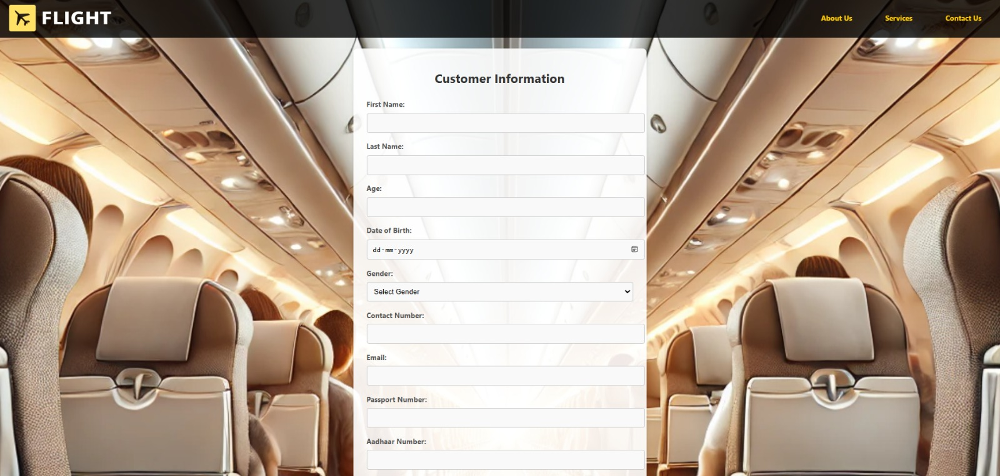
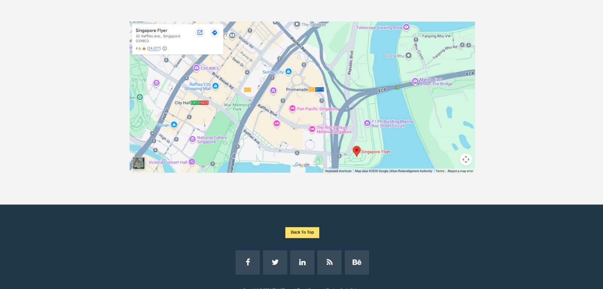

# Online Flight Ticketing System

A web-based flight ticket booking system that allows users to search flights, book tickets, and manage passenger information. Built with PHP, MySQL, HTML/CSS, Bootstrap, and JavaScript.

> **Note:** This was a collaborative group project.

## Screenshots

### Home Page - Flight Search


### Customer Information Form


### Contact Page


### Google Maps Integration


## Features

- **Flight Search** - Search available flights by origin, destination, departure/return dates, and trip type (round/one-way)
- **Ticket Booking** - Complete passenger information form with personal details, travel documents, and meal preferences
- **Booking Management** - View, update, and delete customer bookings (CRUD operations)
- **File Upload** - Upload supporting documents during booking
- **Contact Page** - Google Maps integration with office location
- **Responsive Design** - Mobile-friendly UI using Bootstrap

## Architecture

```
┌─────────────────────────────────────────────────────────────────┐
│                        CLIENT (Browser)                         │
│  ┌──────────┐  ┌──────────────┐  ┌──────────┐  ┌────────────┐  │
│  │index.html│  │cust_info.html│  │contact   │  │newindex    │  │
│  │(Landing) │  │(Booking Form)│  │.html     │  │.html       │  │
│  └────┬─────┘  └──────┬───────┘  └──────────┘  └────────────┘  │
│       │               │                                         │
│  ┌────┴───────────────┴─────────────────────────────────────┐   │
│  │  CSS (Bootstrap, Custom Styles) + JS (jQuery, Plugins)   │   │
│  └──────────────────────────────────────────────────────────┘   │
└─────────────────────────┬───────────────────────────────────────┘
                          │ HTTP (Form Submit)
                          ▼
┌─────────────────────────────────────────────────────────────────┐
│                     SERVER (PHP / Apache)                        │
│  ┌──────────────┐  ┌──────────────┐  ┌────────────────────────┐ │
│  │ cust_info.php │  │  update.php  │  │  read_customers.php    │ │
│  │ (Create)      │  │  (Update)    │  │  (Read - List All)     │ │
│  └──────┬───────┘  └──────┬───────┘  └───────────┬────────────┘ │
│         │                 │                       │              │
│  ┌──────┴─────────────────┴───────────────────────┴────────┐    │
│  │                    db_connect.php                        │    │
│  │              (Database Connection Layer)                 │    │
│  └──────────────────────────┬──────────────────────────────┘    │
│                              │                                   │
│  ┌──────────────┐           │    ┌──────────────────────────┐   │
│  │  delete.php   │───────────┤    │      uploads/            │   │
│  │  (Delete)     │           │    │  (Document Storage)      │   │
│  └──────────────┘           │    └──────────────────────────┘   │
└─────────────────────────────┼───────────────────────────────────┘
                              │ MySQL Protocol
                              ▼
┌─────────────────────────────────────────────────────────────────┐
│                    DATABASE (MySQL)                              │
│  ┌────────────────────────────────────────────────────────────┐  │
│  │  Database: pbl                                             │  │
│  │  ┌──────────────────────────────────────────────────────┐  │  │
│  │  │  Table: customers                                     │  │  │
│  │  │  ─────────────────────────────────────────────────    │  │  │
│  │  │  id | firstName | lastName | age | dob | gender |     │  │  │
│  │  │  contactNumber | email | passportNo | aadhaarNo |     │  │  │
│  │  │  mealPreferences | flightTiming | nationality |       │  │  │
│  │  │  fileUpload | created_at                              │  │  │
│  │  └──────────────────────────────────────────────────────┘  │  │
│  └────────────────────────────────────────────────────────────┘  │
└─────────────────────────────────────────────────────────────────┘
```

## Tech Stack

| Layer      | Technology                          |
|------------|-------------------------------------|
| Frontend   | HTML5, CSS3, Bootstrap 3, JavaScript |
| Backend    | PHP 7.4+                            |
| Database   | MySQL 5.7+ / MariaDB               |
| Server     | Apache (XAMPP/WAMP/Docker)          |
| Libraries  | jQuery, Font Awesome, Datepicker    |

## Project Structure

```
Online-Ticketing-System/
├── css/                    # Stylesheets
│   ├── bootstrap.css       # Bootstrap framework
│   ├── tooplate-style.css  # Custom theme styles
│   ├── datepicker.css      # Date picker styles
│   ├── fontAwesome.css     # Icon fonts
│   ├── hero-slider.css     # Hero section slider
│   └── owl-carousel.css    # Carousel component
├── js/                     # JavaScript files
│   ├── main.js             # Custom scripts
│   ├── datepicker.js       # Date picker plugin
│   ├── plugins.js          # jQuery plugins
│   └── vendor/             # Third-party JS (jQuery, Bootstrap)
├── img/                    # Image assets
├── fonts/                  # Web fonts (FontAwesome, Glyphicons)
├── uploads/                # User-uploaded documents
├── database/               # Database files
│   └── schema.sql          # Database schema & table creation
├── screenshots/            # Application screenshots
├── index.html              # Landing page with flight search
├── newindex.html            # Alternative home page
├── cust_info.html          # Customer booking form
├── contact.html            # Contact page with Google Maps
├── cust_info.php           # Process booking (Create)
├── read_customers.php      # View all bookings (Read)
├── update.php              # Edit booking (Update)
├── delete.php              # Remove booking (Delete)
├── db_connect.php          # Database connection config
├── docker-compose.yml      # Docker setup for easy deployment
├── .env.example            # Environment variables template
├── .gitignore              # Git ignored files
├── CONTRIBUTING.md         # Contribution guidelines
├── LICENSE                 # MIT License
└── README.md               # This file
```

## Getting Started

### Prerequisites

- **PHP** 7.4 or higher
- **MySQL** 5.7+ or MariaDB
- **Apache** web server (XAMPP, WAMP, or MAMP recommended)
- OR **Docker** & Docker Compose

### Option 1: Using XAMPP (Recommended for beginners)

1. **Install XAMPP** from [apachefriends.org](https://www.apachefriends.org/)

2. **Clone the repository**
   ```bash
   git clone https://github.com/jineshagandhi/Online-Flight-Ticketing-System.git
   ```

3. **Copy to XAMPP**
   ```bash
   cp -r Online-Flight-Ticketing-System/ /path/to/xampp/htdocs/
   ```

4. **Start Apache and MySQL** from the XAMPP Control Panel

5. **Create the database**
   - Open phpMyAdmin at `http://localhost/phpmyadmin`
   - Import `database/schema.sql`
   - Or run it from MySQL CLI:
     ```bash
     mysql -u root -p < database/schema.sql
     ```

6. **Configure database credentials**
   - Copy `.env.example` to `.env` and update credentials
   - Or update `db_connect.php` directly with your MySQL password

7. **Open the application**
   ```
   http://localhost/Online-Flight-Ticketing-System/
   ```

### Option 2: Using Docker

1. **Clone the repository**
   ```bash
   git clone https://github.com/YOUR_USERNAME/Online-Flight-Ticketing-System.git
   cd Online-Flight-Ticketing-System
   ```

2. **Start the containers**
   ```bash
   docker-compose up -d
   ```

3. **Access the application**
   - App: `http://localhost:8080`
   - phpMyAdmin: `http://localhost:8081`

4. **Stop the containers**
   ```bash
   docker-compose down
   ```

## Database Schema

The system uses a single `customers` table:

| Column           | Type         | Description                  |
|------------------|--------------|------------------------------|
| id               | INT (PK)     | Auto-increment primary key   |
| firstName        | VARCHAR(100) | Passenger first name         |
| lastName         | VARCHAR(100) | Passenger last name          |
| age              | INT          | Passenger age                |
| dob              | DATE         | Date of birth                |
| gender           | ENUM         | Male / Female / Other        |
| contactNumber    | VARCHAR(15)  | Phone number                 |
| email            | VARCHAR(150) | Email address                |
| passportNo       | VARCHAR(20)  | Passport number              |
| aadhaarNo        | VARCHAR(12)  | Aadhaar ID number            |
| mealPreferences  | VARCHAR(50)  | Meal choice                  |
| flightTiming     | VARCHAR(50)  | Preferred flight time        |
| fileUpload       | VARCHAR(255) | Uploaded document filename   |
| nationality      | VARCHAR(50)  | Passenger nationality        |
| created_at       | TIMESTAMP    | Record creation time         |

## API / Page Routes

| Route                  | Method | Description                          |
|------------------------|--------|--------------------------------------|
| `index.html`           | GET    | Landing page with flight search form |
| `cust_info.html`       | GET    | Customer information booking form    |
| `cust_info.php`        | POST   | Process booking and save to database |
| `read_customers.php`   | GET    | List all customer bookings           |
| `update.php?id=X`      | GET    | Show edit form for booking X         |
| `update.php?id=X`      | POST   | Save updated booking X               |
| `delete.php?id=X`      | GET    | Delete booking X                     |
| `contact.html`         | GET    | Contact page with Google Maps        |

## Author

**Jinesha Gandhi**

## License

This project is licensed under the MIT License - see the [LICENSE](LICENSE) file for details.
